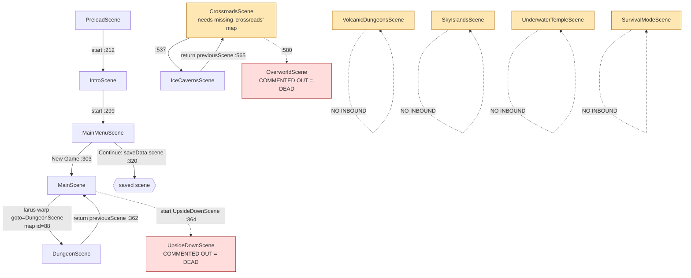

# Findings: World, Maps & Connectivity (`codebase-world-map`)

Gatherer #3 — Neverquest "coherent one-chapter game" research.
Scope: what world content exists, how maps are built/loaded, and the ACTUAL vs INTENDED
world connectivity graph (including the static-grep blind spot: warp targets stored in
Tiled object-layer properties).

> Method note: the `Read` tool was being intercepted by a memory-dedup hook that truncated
> files to line 1, so file contents were read via `cat -n` / `sed -n` in bash. Map JSON
> object layers were parsed with a `node` one-liner. All citations are `path:line` and were
> verified against the working tree on branch `test/logger-interfacecontroller-coverage`.

---

## 1. How maps are built & loaded

Two distinct map systems exist:

### A. Tiled maps (authored `.json`) — `NeverquestMapCreator`
- `src/plugins/NeverquestMapCreator.ts:118-162` — `create()` does `scene.make.tilemap({ key: mapName })`,
  adds tileset images, builds layers, reads layer props `depth`/`collides`, finds the player
  `spawn` object (`spawnObjectLayer = 'spawn'`, `spawnObjectPoint = MapObjectNames.SPAWN_POINT`,
  `:71-76`), and spawns the `Player`.
- Default map is `'larus'` (`NeverquestMapCreator.ts:56,112`) — scenes that call
  `new NeverquestMapCreator(this)` with no key get **larus**.
- Tileset wiring is **hard-coded** in `tilesetImages` (`:101-105`): `base→tiles_overworld`,
  `inner→inner`, `collision→collision_tiles`. This assumes a map whose tileset names are
  `base`/`inner`/`collision` — i.e. tuned for `larus`. (overworld/town/cave only declare a
  `base` tileset; tutorial declares 4.)
- Maps are registered for preload in `src/consts/GameAssets.ts` `TilemapConfig`
  (`:516-538`): keys **larus, tutorial, town, cave_dungeon, overworld**. Loaded by
  `PreloadScene.ts:79-81` (`this.load.tilemapTiledJSON(value.name, value.json)`).

### B. Procedural dungeons — `NeverquestDungeonGenerator`
- `src/plugins/NeverquestDungeonGenerator.ts:140-160` — builds a **blank** tilemap in code
  (`make.tilemap({ tileWidth:48, tileHeight:48, width, height })`), paints rooms, no Tiled
  asset required. Tileset image is `dungeon_tiles` (GameAssets `:335`).
- Used by all 5 biome scenes (Dungeon, IceCaverns, Volcanic, SkyIslands, UnderwaterTemple).
  These are **self-contained procedural arenas** — they have NO map-asset dependency and
  NO authored warp objects.

**Confidence: High.** Direct reads of both plugins + PreloadScene + GameAssets.

---

## 2. Full map / tileset asset inventory → consuming scene

Authored Tiled maps on disk: `src/assets/maps/{overworld,town,cave,tutorial,larus}/*.json`
(plus `.tmx` source). A `dungeon/` folder has **only `dungeon.tmx` + PNGs, NO `.json`** → it
can never be loaded by Phaser (Phaser needs the `.json`); it is source-only.

| Map asset (`.json`) | Registered key | Size / infinite | Object layers | Consuming scene (active?) |
|---|---|---|---|---|
| `larus/larus.json` | `larus` | 100×100, infinite | info, enemies, particles, markers, **warps**, spawn | **MainScene** (default key, `MainScene.ts:99`) ✅ active; also TutorialScene/UpsideDownScene (default key) — both commented out |
| `tutorial/tutorial.json` | `tutorial` | 100×100, infinite | info, enemies, particles, markers, **warps**, spawn | **TutorialScene** (default key, `TutorialScene.ts:43`) — ❌ commented out (index.ts:52,119) |
| `overworld/overworld.json` | `overworld` | 50×50 | **info only** (no warps/spawn) | **OverworldScene** (`OverworldScene.ts:69`) — ❌ commented out (index.ts:41,117) |
| `town/town.json` | `town` | 30×30 | **info only** | **TownScene** (`TownScene.ts:66`) — ❌ commented out (index.ts:51,115) |
| `cave/cave_dungeon.json` | `cave_dungeon` | 40×40 | **info only** | **CaveScene** (`CaveScene.ts:58`) — ❌ commented out (index.ts:25,116) |
| `dungeon/dungeon.tmx` | — (no json) | — | — | **orphaned** (no JSON, unregistered) |

Tilesets in `src/assets/maps/tilesets/`: `Overworld.png`, `Overworld-extruded.png`,
`Inner.png`, `Inner-extruded.png`, `collision.png`, `tutorial_tileset.png`,
`tutorial_tileset_extruded.png`; biome procedural tileset `maps/dungeon/dungeon_tileset.png`.
All imported in `GameAssets.ts:64-68,133` and registered in `ImageConfig`/`TilesetConfig`.

**Procedural biome scenes (no map asset):** DungeonScene, IceCavernsScene,
VolcanicDungeonsScene, SkyIslandsScene, UnderwaterTempleScene — all use
`NeverquestDungeonGenerator`.

**CrossroadsScene anomaly (critical):** `CrossroadsScene.ts:102` does
`new NeverquestMapCreator(this, 'crossroads')`, but **there is NO `crossroads` map asset on
disk and NO `crossroads` key in `TilemapConfig`** (verified: `grep -i crossroads
GameAssets.ts` → none; `find src/assets -iname '*crossroad*'` → none). So
`make.tilemap({key:'crossroads'})` yields an empty map → Crossroads cannot build its
world/spawn from a Tiled map.

**Confidence: High.** Inventory cross-checked against `GameAssets.ts` registrations and
node-parsed object layers.

---

## 3. Warp object-layer contents (the static-grep blind spot, resolved)

`NeverquestWarp` reads warp zones from the Tiled object layer named `warps`
(`NeverquestWarp.ts:80`). A warp's `goto` property (`:85`) is either:
- a **destination object id** within the same map (in-map teleport), OR
- a **scene key** when a `scene=true` property (`:90`) is also present →
  `this.scene.scene.start(sceneKey, { previousScene })` (`NeverquestWarp.ts:194-208`).

I parsed every map JSON's object layers. Results:

| Map | `warps` layer? | In-map warps | **Scene-change warps (`scene=true`)** |
|---|---|---|---|
| `larus` | yes (9 objs) | house↔field↔floors (goto=16/23/26/42) | **1: `id=88 "dungeon" {goto="DungeonScene", scene=true}` @(-214,-201)** |
| `tutorial` | yes (4 objs) | house in/out (goto=10/11) | none |
| `overworld` | **no** | — | — |
| `town` | **no** | — | — |
| `cave_dungeon` | **no** | — | — |

**The ONLY inter-scene edge encoded in any map asset is `larus → DungeonScene`.** Every
other inter-scene link in the game lives in TypeScript `scene.start(...)` calls, not in map
properties. overworld/town/cave_dungeon are world-less single-room maps with only an `info`
welcome message and **no spawn point and no warps** — as authored they are essentially
flavor stubs, not traversable areas.

**Confidence: High.** Object layers parsed directly from JSON; warp resolution logic read
from `NeverquestWarp.ts:181-209`.

---

## 4. ACTUAL world connectivity graph (active build)

Active scene list (`src/index.ts:103-133`): PreloadScene, IntroScene, MainScene,
MainMenuScene, DungeonScene, IceCavernsScene, VolcanicDungeonsScene, SkyIslandsScene,
UnderwaterTempleScene, CrossroadsScene, SurvivalModeScene (+ UI: Dialog, HUD, Inventory,
Attribute, QuestLog, CharacterStats, Journal, SpellWheel).

Commented OUT (exist on disk, not registered): OverworldScene, TownScene, CaveScene,
TutorialScene, UpsideDownScene, GameOverScene, JoystickScene, MobileCheckScene, SettingScene,
VideoPlayerScene (`index.ts:25,33,37,40,41,48,50-53,118,...`).

Inter-scene edges actually present (gameplay/world only; UI launches omitted):



What this means concretely:
- **The only working world loop is `MainScene (larus) ⇄ DungeonScene`.** You boot →
  Intro → Menu → New Game → MainScene (larus overworld), walk to the warp at world-coord
  (-214,-201), enter a procedural DungeonScene, clear/exit, return to MainScene. That is the
  entire reachable world in the active build.
- **`MainScene → UpsideDownScene` (MainScene.ts:364) is a dead warp** — UpsideDownScene is
  commented out of the scene list (`index.ts:107`). Calling `scene.start('UpsideDownScene')`
  on an unregistered key throws/no-ops. (Confirms planner pre-finding.)
- **CrossroadsScene is unreachable in the active build.** Nothing active starts it — only
  `OverworldScene.ts:227` does, and OverworldScene is commented out. Even if reached,
  Crossroads loads the **missing `crossroads` map** → no spawn/world.
- **IceCavernsScene** is reachable only via Crossroads (`:537`) → transitively unreachable.
- **VolcanicDungeonsScene, SkyIslandsScene, UnderwaterTempleScene, SurvivalModeScene have
  ZERO inbound `scene.start`/`scene.launch` from any scene** (verified by grep across
  `src/`). They are fully built, registered, but **orphaned — no entry point exists**.
- **Biome return targets are broken too:** default `previousScene` is `CrossroadsScene`
  (Ice/Volcanic/Sky `:79/:83/:97`) or `TownScene` (Underwater `:96`). Both are
  unreachable/commented-out, so even a directly-launched biome would "return" into a broken
  scene.

`MainMenuScene` "Continue" resumes `saveData.scene` (`MainMenuScene.ts:320`) — so a save made
in any scene tries to reboot directly into it; safe only for MainScene/DungeonScene given the
above.

**Confidence: High** for all edges (every `scene.start`/`launch` enumerated with file:line).

---

## 5. INTENDED world graph (per `docs/ROADMAP.md`)

ROADMAP "0.4.0 — World Building", `docs/ROADMAP.md:343-362`:

```
Village (Hub) → Forest → Cave → Town → Desert → Ice Caverns → Volcano
              ↘ Secret Forest Shrine                    ↘ Sky Islands
                                          Underwater Temple → Undead Crypts → Final Boss
```
Progression gates (`:353-362`): Forest L1-5 (start) → Cave (clear forest dungeon) → Town
(reach L10) → Desert (clear cave boss) → Ice Caverns (clear desert trial) → Volcano (fire
key) → Sky Islands (clear volcano boss) → Underwater Temple (hidden entrance in town) →
Final Boss (all biomes). Roadmap "existing" notes (`:26`) list
MainScene/TownScene/CaveScene/OverworldScene/DungeonScene as the world scenes.

### Intended vs actual — gap table

| Intended node | Asset/Scene that exists | Wired into active world? |
|---|---|---|
| Village/Forest (Hub start) | `larus` map + MainScene; also OverworldScene+`overworld` | **Partly** — MainScene/larus is the de-facto hub; Overworld(forest) commented out |
| Cave | CaveScene + `cave_dungeon` map | **No** — scene commented out; map has no warps/spawn |
| Town | TownScene + `town` map | **No** — scene commented out; map has no warps/spawn |
| Desert | — | **Missing entirely** (no scene, no map) |
| Ice Caverns | IceCavernsScene (procedural) | reachable only via (unreachable) Crossroads |
| Volcano | VolcanicDungeonsScene (procedural) | **No inbound edge** |
| Sky Islands | SkyIslandsScene (procedural) | **No inbound edge** |
| Underwater Temple | UnderwaterTempleScene (procedural) | **No inbound edge** |
| Undead Crypts / Final Boss | — | **Missing entirely** |
| Hub | CrossroadsScene (intended new hub) | broken (missing `crossroads` map), unreachable |

The codebase clearly *attempted* a hub-and-spoke refactor (Crossroads as the new hub feeding
the biomes) layered on top of the original linear larus/town/cave world — but the refactor
was left half-wired: the hub map was never authored, the hub is never started, and the spoke
biomes were never given inbound edges from the hub except IceCaverns.

**Confidence: High** for ROADMAP intent (direct quote); **High** for the gap mapping.

---

## 6. What is shippable for a Chapter 1 open world (reuse-first)

Ranked by least work to a coherent, traversable Chapter 1:

**Tier 1 — already works, build the chapter around it:**
- **`larus` (MainScene) as the Chapter 1 hub/overworld.** It is the most complete authored
  map: 100×100 infinite, real collision, player spawn, 14 info/lore objects, 9 enemy spawn
  groups, NPC/marker objects, in-map house+floor warps, and a working scene warp to a dungeon.
  It is the single map that already demonstrates the full toolchain end-to-end.
- **`larus ⇄ DungeonScene` loop.** The one functioning hub→biome→return loop. This is the
  reusable template for connecting every other biome: add a `warps` object with
  `{goto:"<SceneKey>", scene=true}` to the larus map, set the biome's `previousScene` to
  `MainScene`.

**Tier 2 — fully built, just need an entry edge (cheap wins):**
- **IceCaverns, Volcanic, SkyIslands, UnderwaterTemple** biome scenes. Each is a complete,
  registered, self-contained procedural arena. To ship them in Chapter 1, the only required
  work is (a) add a scene-warp object to larus pointing at each (or gate them behind a flag),
  and (b) fix each biome's `previousScene` default to a reachable scene (`MainScene`).
  No new art/maps needed — they generate their own layouts.
- **SurvivalModeScene** — built and registered; add one entry (e.g. a portal/menu option) and
  it's playable side content.

**Tier 3 — needs authoring before use:**
- **OverworldScene/`overworld`, TownScene/`town`, CaveScene/`cave_dungeon`** — scenes exist
  but are commented out AND their maps are content-empty (info layer only, no spawn, no
  warps). Usable only after authoring spawn+warps in the `.json` and re-registering the scene.
  Higher effort than reusing larus.
- **CrossroadsScene** — promising as a hub but blocked on the missing `crossroads` map asset.
  Either author that map, or repoint Crossroads' `NeverquestMapCreator` at an existing key
  (e.g. `'larus'`), or drop Crossroads and use larus as the hub (recommended, least work).

**Recommended Chapter 1 shape (reuse-first):** larus = hub. Add 2-4 scene-warps in
`larus.json` `warps` layer pointing to existing procedural biomes (start with DungeonScene
which already works, then Ice/Volcanic), each with `previousScene` returning to MainScene.
This yields a coherent hub-and-spoke Chapter 1 with **zero new map authoring** beyond editing
larus's warp object layer.

---

## 7. Connectivity gaps to close (prioritized)

1. **Dead warp:** `MainScene.ts:364` starts `UpsideDownScene`, which is commented out
   (`index.ts:107`). Either re-enable UpsideDownScene or repoint this warp. *(High)*
2. **Orphaned biomes:** Volcanic/SkyIslands/UnderwaterTemple/Survival have **no inbound
   edge** — unreachable. Add entry warps (from larus) or hub buttons. *(High)*
3. **Broken hub:** CrossroadsScene loads non-existent `crossroads` map and is itself never
   started in the active build. Decide: author the map, repoint to larus, or retire Crossroads.
   *(High)*
4. **Broken returns:** biome `previousScene` defaults point at unreachable
   `CrossroadsScene`/`TownScene`. Repoint to a reachable hub (MainScene). *(Med)*
5. **Content-empty maps:** overworld/town/cave_dungeon JSON have only an `info` object — no
   spawn, no warps. Need authoring before they can host playable areas. *(Med)*
6. **Source-only map:** `maps/dungeon/dungeon.tmx` has no exported `.json` — unusable as-is. *(Low)*
7. **Missing intended nodes:** Desert, Undead Crypts, Final Boss from ROADMAP don't exist as
   scenes or maps — out of scope for a minimal Chapter 1; note as future content. *(Low)*

---

## Evidence index (key citations)

- Warp mechanism & scene-change: `src/plugins/NeverquestWarp.ts:80,85,90,120-209`
- Map loader / default 'larus' / tileset wiring: `src/plugins/NeverquestMapCreator.ts:56,101-105,112-162`
- Procedural dungeon (no asset): `src/plugins/NeverquestDungeonGenerator.ts:140-160`
- Registered map keys: `src/consts/GameAssets.ts:159-163,516-538`
- Map preloading: `src/scenes/PreloadScene.ts:79-81,212`
- Active/commented scene list: `src/index.ts:24-53,103-133`
- larus scene-warp to dungeon: `src/assets/maps/larus/larus.json` warps obj id=88 `{goto:"DungeonScene", scene:true}`
- MainScene map+dead warp: `src/scenes/MainScene.ts:99,364`
- DungeonScene return: `src/scenes/DungeonScene.ts:57,71-73,362`
- Crossroads → Ice/Overworld + missing map: `src/scenes/CrossroadsScene.ts:102,537,580`
- Biome `previousScene` defaults: IceCaverns `:79`, Volcanic `:83`, SkyIslands `:97`, Underwater `:96`, Dungeon `:57`
- Save-resume target: `src/scenes/MainMenuScene.ts:320`
- Intended world graph & gates: `docs/ROADMAP.md:26,343-362`
