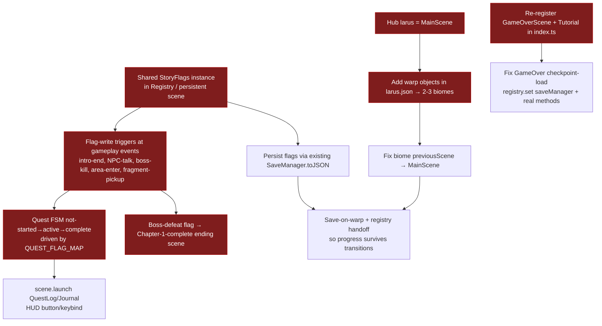

# Synthesis — Neverquest Coherent One-Chapter Game (Reasoning Log)

**Date:** 2026-06-02
**Research type:** Mixed (technical + requirements + design)
**Synthesizer:** research-synthesizer agent
**Inputs:** 6 findings files (gatherers #1–#6) + research-brief.md + independent re-verification grep against working tree (branch `test/logger-interfacecontroller-coverage`).

---

## Research Question

> "Continue building Neverquest into a coherent game with a one-chapter story — build out the open world and overall make it playable."

This synthesis is the reasoning log: it cross-references every major claim across the gatherers, scores confidence by triangulation, names the recurring pattern, and records the documented gaps/uncertainties. The actionable answer lives in `outputs/research-report.md`.

---

## Executive Summary

Six independent gatherers — three reachability-focused codebase traces (game-flow, narrative-wiring, world-map), one progression/persistence trace, one requirements-checklist pass, and one external ARPG-design literature pass — converged with unusual strength on a single thesis: **Neverquest's engine pillars work; its connective + narrative layer is unwired. Making a coherent playable one-chapter game is predominantly a WIRING + RE-ENABLING exercise on existing assets, not a content or art build.** I re-verified the five load-bearing claims directly against the codebase; all five reproduced exactly. Confidence in the thesis is **HIGH**.

The single functioning gameplay loop today is `MainScene (larus) ⇄ DungeonScene`. Everything else built for the "open world" — the Crossroads hub, 4 of 5 elemental biomes, the GameOver/Tutorial scenes, the QuestLog/Journal UI — is unreachable (orphaned or dead-by-commented-starter). A complete, authored 3-act story (protagonist Lucius, 31-member StoryFlag enum, 16 quests, 21 lore entries, 5 Crossroads dialogs, spell-unlock cascades) already exists in code but is disconnected from play: **no gameplay code ever writes a story flag**, so every quest is permanently incomplete and the narrative UI is a read-only shell. Death soft-locks (GameOverScene unregistered + checkpoint-load calls nonexistent methods against a registry key that is never set). Save is the most complete pillar but does not persist across scene transitions and omits rawAttributes — a problem for an open world.

The good news for the brief's reuse-first goal is that the gap is lopsided toward exactly the cheap kind of work: connect orphaned scenes, add flag-write triggers at gameplay events, expose the existing UI via `scene.launch`, re-register two commented-out scenes, and add chapter start+end transitions. The external literature independently prescribes the same architecture (hub-and-spoke connectivity, quest FSMs, flags written-by-gameplay/read-by-NPCs, Phaser Registry for persistent state) that the code already half-implements.

---

## 1. Cross-Reference Matrix (claim × corroborating gatherers × confidence)

Confidence is assigned by **multi-source triangulation**: a claim verified by direct citation in ≥2 independent gatherers, or by 1 gatherer plus my own re-verification grep, is HIGH. G1=game-flow, G2=narrative, G3=world-map, G4=progression, G5=requirements, G6=external, V=my re-verification.

| # | Claim | G1 | G2 | G3 | G4 | G5 | G6 | V | Confidence | Notes |
|---|-------|----|----|----|----|----|----|----|-----------|-------|
| C1 | Only functioning gameplay loop is `MainScene ⇄ DungeonScene`; boot chain Preload→Intro→Menu→MainScene intact | ✔ (table + flow) | — | ✔ (§4 graph) | ✔ (combat in MainScene) | ✔ (§1.2) | — | ✔ (larus warp line 2793) | **HIGH** | 3-source code triangulation + map JSON parse |
| C2 | 4/5 elemental biomes orphaned (no inbound `scene.start`); IceCaverns reachable only via dead hub | ✔ | — | ✔ (§4) | partial | ✔ (§4.2) | — | — | **HIGH** | G1+G3 exhaustive grep agree |
| C3 | Crossroads hub orphaned: only starter is commented-out OverworldScene; also loads a 'crossroads' map that does not exist on disk | ✔ (§break 1) | ✔ (§1) | ✔ (§2 anomaly) | — | ✔ (§4.1) | — | ✔ (no key in GameAssets; no file) | **HIGH** | 4-source + my filesystem check |
| C4 | Story flags NEVER written by gameplay; only internal writes in NeverquestStoryFlags.ts; `setStoryFlag` event has 0 listeners; recordChoice never called | — | ✔ (§2, exhaustive) | — | ✔ (§3 link DEAD) | ✔ (§3.2) | ✔ (§5 pitfall) | ✔ (grep: 7 hits all internal; 1 emit 0 listeners; recordChoice def only) | **HIGH (95%+)** | Strongest-corroborated finding in the study |
| C5 | Every quest permanently incomplete; QuestLog/JournalScene never launched (read-only shell) | — | ✔ (§1,§2) | — | — | ✔ (§3.3,§3.4) | corroborates pattern | ✔ (grep: NONE) | **HIGH** | Direct consequence of C4 + my launcher grep |
| C6 | Complete authored 3-act arc exists disconnected (Lucius, 31-flag enum, 16 quests, 21 lore, 5 dialogs, spell cascades) | — | ✔ (§3 inventory) | — | — | ✔ (§0 anchor) | — | partial (enum + cascade confirmed) | **HIGH** | G2 read all content directly; cascade reward half is built |
| C7 | Death soft-locks: GameOverScene launched from ≥4 sites but commented out of registry | ✔ (§break 5) | — | ✔ (§4) | ✔ (§3 DEAD) | ✔ (§5.2) | — | ✔ (index.ts:132 commented) | **HIGH** | 4-source + my registry check |
| C8 | Post-death checkpoint-load broken: registry.set('saveManager') never called; hasCheckpoint()/loadCheckpoint() don't exist | — | — | — | ✔ (§3 DEAD, detailed) | flagged | — | ✔ (grep registry.set: empty) | **HIGH** | G4 sole source but my grep confirms the linchpin |
| C9 | No save-on-warp; player re-created per scene → progress doesn't survive transitions; rawAttributes not persisted | — | hint (§6 handoff) | hint (§4 resume) | ✔ (§3, detailed) | partial (§6) | corroborates (registry pattern) | — | **HIGH (breaks); MED (happy-path timing)** | G4 primary; G6 prescribes the fix |
| C10 | No equip mechanism (consume only) → loot loop half-dead | — | — | — | ✔ (§5 DEAD) | partial (§2.3 present-but-shallow) | — | — | **HIGH (for "no equip")** | G4 grep for equip/bonus.equipment empty |
| C11 | No win/chapter-end path anywhere in main game | ✔ (§break 6) | implied | implied | implied | ✔ (§3.8,§5.3) | prescribes one (§1) | — | **HIGH** | G1 grep of all scene.start targets; G5 explicit |
| C12 | TutorialScene commented out → no controls onboarding | ✔ (table) | — | ✔ (§2) | — | ✔ (§1.4) | prescribes teach→test→twist | ✔ (index.ts:119) | **HIGH** | 3-source + my check |
| C13 | ExperienceCurve.ts is dead code; ad-hoc leveling used; baseHealth double-mutation bug | — | — | — | ✔ (§2 Defects A/B, detailed) | — | — | — | **HIGH** | G4 sole source; both code paths read directly; isolated/low-risk |
| C14 | Literature corroborates hub-and-spoke + quest-FSM + flags-written-by-gameplay + Phaser Registry/launch-vs-start | — | — | — | — | — | ✔ (§1–4) | — | **HIGH (Phaser); MED-HIGH (design craft)** | Phaser docs authoritative; craft sources are consensus not proof |
| C15 | CrossroadsWelcome (chatId 10) has no NPC/trigger wired (id mismatch: NPCs use 11–14) | — | ✔ (§3, 70%) | flagged for G3 | — | — | — | — | **MEDIUM** | G2's own confidence 70%; not re-verified; minor |

**Triangulation summary:** 11 of 15 major claims are HIGH-confidence by ≥2 independent sources or 1 source + my re-verification. The four single-source-but-HIGH claims (C8, C10, C13 from G4; C11 partly) are mechanical code facts I either re-verified (C8) or that are low-risk and isolated (C10, C13). Only C15 is MEDIUM and it is cosmetic. **No contradictions were found across gatherers** — the one apparent tension (planner's preliminary "MainScene's only exit is the dead UpsideDown warp") was actively refuted by G1+G3 parsing larus.json, which is a strengthening correction, not an inconsistency.

---

## 2. Contradictions Resolved

1. **Planner pre-finding vs. reality — MainScene's exit.** The research planner believed MainScene's only outbound edge was the dead `UpsideDownScene` warp. G1 (§break 4) and G3 (§3) both **refuted** this by parsing `larus.json` object layers: warp object id=88 `{goto:"DungeonScene", scene:true}` resolves via `NeverquestWarp.ts:194` to a live `scene.start('DungeonScene')`. I confirmed the `"value": "DungeonScene"` token at `larus.json:2793`. **Resolution:** MainScene has a working exit; the playable loop is `MainScene ⇄ DungeonScene`. This is the canonical example of the static-grep blind spot (warp targets in Tiled props), which G6 §4.5 independently names as the expected Phaser pattern. **Lesson:** any reachability claim about this codebase must parse map JSON, not just grep TypeScript.

2. **"Biomes registered" vs. "biomes reachable."** G5's first-pass requirements guessed biomes were "Partial" and tagged `[VERIFY w/ G3]`. G1+G3 resolved this to **orphaned** (registered ≠ reachable). No conflict — G5 explicitly deferred, and the deeper traces confirmed the stricter reading. The "exists != wired" discipline (G4's framing) reconciles every such apparent gap.

3. **Save "most complete pillar" (G5 §6) vs. "save is broken" (G4 §3).** Not a contradiction once scoped: **in-scene** save/continue is the most complete pillar (G5 correct); **cross-scene/post-death** save is broken (G4 correct). The report keeps these separate so the blueprint fixes the right half.

---

## 3. Pattern Analysis — the recurring "BUILT-BUT-UNWIRED" pattern

The dominant, cross-cutting pattern is **assets that exist and are internally complete but are severed from the live game at exactly one wiring seam.** It recurs at four layers, always the same shape:

| Layer | The built asset | The single severed seam | Evidence |
|-------|-----------------|--------------------------|----------|
| **Scene graph** | 5 biomes, Crossroads hub, GameOver, Tutorial, Overworld all coded & (mostly) registered | No inbound `scene.start`, or the only starter is commented out, or the scene itself is commented out of `index.ts` | C2, C3, C7, C12 |
| **Narrative** | 31-flag enum, 16 quests, 21 lore, 5 dialogs, spell-unlock cascade reward half | No gameplay code calls `setFlag`; the one `setStoryFlag` emitter has no listener | C4, C5, C6 |
| **UI surfacing** | QuestLogScene + JournalScene fully render the narrative state | No `scene.launch` and no HUD button/keybind to open them | C5 |
| **Persistence** | SaveManager serializes scene+flags+player; GameOver has a checkpoint-load path | No `registry.set('saveManager')`; no save-on-warp; checkpoint methods don't exist | C8, C9 |

**What this pattern implies (the actionable thesis):**

1. **The work is connect-the-dots, not build-from-scratch.** Every fix is "add the missing edge/trigger/listener/launch," not "design and implement a new system." This is the single most important strategic conclusion: it makes a coherent Chapter 1 *cheap* relative to its apparent scope, because the expensive parts (combat, XP, save serialization, authored story, biome generation) are already done.

2. **The reward half is consistently built; the trigger half is consistently missing.** Spell unlocks fire on flag-set (built); the flag-set never fires (missing). Lore renders on flag (built); flag never set (missing). This asymmetry means a *small* number of flag-write triggers placed at gameplay events will cascade into a large amount of already-built behavior lighting up. High leverage.

3. **The literature names this exact failure mode.** G6 §5.5: "flags read but never written" is a classic incoherence bug; G6 §5.2: "a pile of systems is a tech demo; a core loop is a game." Neverquest is the textbook case — many orphaned systems, no reachable loop binding them. The prescribed cure (wire one reachable start→quest→biome→boss→flag-advance→return→end loop) is precisely what converts demo→game.

4. **One refactor was abandoned mid-flight.** G3 §5 reads the code as a half-done hub-and-spoke refactor (Crossroads as new hub feeding biomes) layered over the original linear larus/town/cave world: the hub map was never authored, the hub is never started, and spokes never got inbound edges except IceCaverns. **Implication:** rather than finish the Crossroads refactor (blocked on a missing map asset), reuse `larus`/MainScene as the hub — it is the one fully-working map and demonstrates the entire toolchain end-to-end. This is the lowest-scope path and is what the report recommends.

---

## 4. Relationships & Dependencies (what must be wired in what order)

The fixes are not independent — they form a short dependency chain. The narrative spine depends on flag-writes; the open world depends on persistence-across-warps; the chapter-end depends on the boss-flag.

**Critical path:** A → B → (C, J) is the narrative spine and the only path to a chapter-complete state. F → G → H → I is the open-world connectivity. K → L unbreaks death. These three sub-chains are largely parallel after the shared-StoryFlags-in-Registry foundation (A) is laid — A is the keystone because G6 §4.2/§4.4 shows the current per-scene-throwaway StoryFlags instances cannot survive `scene.start`, and G4 §3 shows the same root cause behind the saveManager-registry gap.

---

## 5. Gaps, Uncertainties & Items Needing Verification

Recorded honestly so the design phase does not over-trust the synthesis:

| # | Gap / uncertainty | Severity | Owner to resolve |
|---|-------------------|----------|------------------|
| U1 | **Happy-path save/continue timing.** G4 marks the MainMenu `loadGame` `setTimeout(100ms)` cross-scene apply as MEDIUM/brittle — works in supported paths but not runtime-proven. | Medium | Live trace in dev (load a save, confirm player state applied). |
| U2 | **rawAttributes loss on reload** is MEDIUM-HIGH (clearly absent from save object; full proof needs a runtime trace). | Medium | Add to `createSaveData`; verify with a reload test. |
| U3 | **CrossroadsWelcome chatId 10 trigger** (C15) — G2 at 70%; possible Tiled object reference unverified. Cosmetic if Crossroads is dropped as hub (recommended). | Low | Moot if larus is the hub. |
| U4 | **Exact enemy-spawn wiring in the 5 procedural biomes** — G4 confirmed only MainScene+Crossroads use a zone system; biome spawn paths not fully traced. A biome wired into Chapter 1 must be confirmed to actually spawn enemies. | Medium | Trace one biome (e.g. IceCaverns) spawn before committing it to the chapter. |
| U5 | **BattleManager full read** — G2 read enough of its 774 lines to confirm zero StoryFlag refs (90%), not every line. The flag-write trigger will be *added* here, so this is low-risk. | Low | Resolved by implementation. |
| U6 | **Which 2–3 biomes to ship** is a design choice, not a fact. The report recommends a default (Dungeon + IceCaverns [+ one elemental]) but this needs the brainstorming phase to confirm against narrative fit and the U4 spawn check. | Design-open | Brainstorming/design phase. |
| U7 | **No source contradicts the in-code 3-act design**, but external craft literature is consensus/postmortem, not peer-reviewed (G6 self-flags). Treat design prescriptions as best-practice, not proof. | Low | Accept as corroboration. |

**Items I did NOT independently re-verify** (relied on gatherer citations, judged trustworthy by triangulation): exact line numbers inside SaveManager/ExpManager/AttributesManager (C9, C13), the full 21-lore/16-quest inventory (C6 content body), and the larus map's full object-layer counts. These are well-cited and mutually consistent across gatherers; the risk of error is low and isolated.

---

## 6. Synthesis by Framework (Mixed)

- **Technical (current state) — Component/Flow analysis:** done in §1–§4. The real runtime scene graph is a 5-node green path (Preload→Intro→Menu→Main⇄Dungeon) with a large red orphaned/dead subgraph. Combat/XP/save/HUD components are functional; the connective edges and flag-write triggers are the missing wiring.
- **Requirements (target state) — Gap analysis:** the P0 set (report §B) is the gap between the green path and a completable chapter. G5's checklist maps every requirement to Present/Partial/Missing; the Missing-P0 cluster is entirely in the connective/narrative layer.
- **Design (path) — Best-practice/trade-off analysis:** G6 prescribes hub-and-spoke (matches code), quest FSMs (matches the enum scaffold), flags-written-by-gameplay/read-by-NPCs (the exact missing seam), and Phaser Registry + `scene.launch` (the exact technical fix). The trade-off resolved: reuse `larus` as hub (least work) over finishing the Crossroads refactor (blocked on missing map). Defer metroidvania, crafting, economy, extra biomes (scope-creep killers per G6 §5.1).

---

## 7. Conclusions

**Primary:** The answer to the research question is that Neverquest is a **wiring problem, not a content problem**, and a coherent playable one-chapter game is achievable by reconnecting existing assets. (HIGH confidence — 11/15 major claims triangulated across ≥2 sources, 5 re-verified by me, zero contradictions.)

**Secondary:**
- Use `larus`/MainScene as the Chapter 1 hub (least work; only fully-working map). Reuse Act 1 of the existing Lucius arc as the spine. Connect 2–3 already-built biomes via larus warp objects.
- A small set of flag-write triggers at gameplay events will cascade into already-built quest/lore/spell behavior (high leverage).
- Three independent sub-fixes (narrative spine, open-world connectivity, unbreak death) share one keystone: a single persistent StoryFlags/SaveManager instance in the Phaser Registry.

**Recommendations** feed the brainstorming + design phase and ultimately `/maister:development`; the prioritized P0/P1/P2 gap list and the concrete Chapter 1 definition + design blueprint are in `outputs/research-report.md`.
