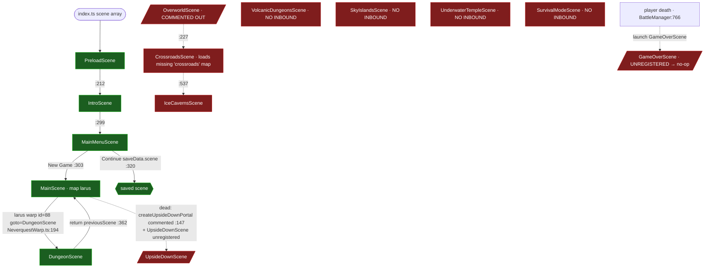

# Research Report — Neverquest: Building a Coherent Playable One-Chapter Game

**Research type:** Mixed (technical current-state + requirements + ARPG design)
**Date:** 2026-06-02
**Researcher:** research-synthesizer agent (synthesizing 6 parallel gatherers)
**Repo / branch:** `neverquest` @ `test/logger-interfacecontroller-coverage`

---

## Table of Contents

1. [Executive Summary](#executive-summary)
2. [Research Objectives](#research-objectives)
3. [Methodology](#methodology)
4. [A. Current-State Map](#a-current-state-map)
5. [B. Coherence Gap List (P0/P1/P2)](#b-coherence-gap-list-p0p1p2)
6. [C. Chapter 1 Definition](#c-chapter-1-definition)
7. [D. Design Blueprint (preview)](#d-design-blueprint-preview)
8. [Open Questions / Risks](#open-questions--risks)
9. [Conclusions](#conclusions)
10. [Appendices](#appendices)

---

## Executive Summary

**What was researched:** How to continue building Neverquest (a Phaser 3 + TypeScript 2D action-RPG) into a coherent, playable game with a one-chapter story and a connected open world.

**How:** Six parallel gatherers ran an iterative-deepening codebase reachability analysis (game-flow, narrative wiring, world-map connectivity, progression/combat/persistence), a requirements-coherence checklist, and an external ARPG-design literature pass — cross-referenced with confidence scoring. The synthesizer re-verified the five load-bearing claims directly against the working tree.

**Headline finding (HIGH confidence):** Neverquest's **engine pillars work** (boot flow, combat, XP/leveling, drops, save serialization, HUD). Its **connective + narrative layer is unwired.** A complete, authored 3-act story already exists in code but is severed from gameplay. **Making a coherent playable one-chapter game is predominantly a WIRING + RE-ENABLING exercise on existing assets — not a content or art build.**

The only loop a player can actually reach today is `MainScene (larus map) ⇄ DungeonScene`. The Crossroads hub, 4 of 5 elemental biomes, the GameOver and Tutorial scenes, and the QuestLog/Journal UI are all built but unreachable. Critically, **no gameplay code ever writes a story flag** (verified: every `setFlag` call is internal to `NeverquestStoryFlags.ts`; the one `setStoryFlag` event has zero listeners) — so all 16 quests are permanently incomplete and the narrative UI is a read-only shell. Death soft-locks. Save works in-scene but does not survive scene transitions — a problem for an open world.

**P0 gap count:** **11** coherence-critical gaps (see §B), all in the connective/narrative/win-lose layer — none in the core combat engine.

**Recommended Chapter 1 (one-liner):** *"The Awakening" — reuse Act 1 of the existing Lucius arc with `larus`/MainScene as the hub-and-spoke center, a 4-beat main quest (awaken → meet Elder → clear the Dungeon for the cave artifact → defeat the Cave Guardian boss), connecting the working Dungeon plus 1–2 already-built biomes via larus warp objects, ending on a "Chapter 1 Complete" screen — ~20–35 min, zero new maps.*

**Overall confidence: HIGH.** 11 of 15 major claims are triangulated across ≥2 independent gatherers; 5 were re-verified by direct grep/file inspection; **no contradictions** were found across sources. The external literature independently prescribes the same architecture the code already half-implements.

---

## Research Objectives

**Primary question:** "Continue building Neverquest into a coherent game with a one-chapter story — build out the open world and overall make it playable."

**Sub-questions:**
1. *(Technical / current state)* What systems exist, how are they wired into the boot/game loop, and which are functional vs. orphaned/stubbed?
2. *(Requirements / target)* What does a coherent, playable one-chapter build minimally require?
3. *(Design / path)* How should story/quest/world-connectivity be architected to tie existing systems into one playthrough, reusing what exists?

**Scope — included:** existing systems inventory, real runtime flow, gap analysis, a scoped Chapter 1 using existing assets, and an architecture blueprint. **Excluded:** multiplayer, terminal edition, net-new biomes/art, crafting/economy/skill-trees, deep perf work (per brief).

---

## Methodology

| Aspect | Detail |
|--------|--------|
| Research type | Mixed — codebase reachability (iterative deepening) + requirements synthesis + literature corroboration |
| Data sources | 6 findings files (gatherers #1–#6); the real scene graph built from `src/index.ts` + repo-wide grep of every `scene.start/launch/run/switch`; Tiled map JSON object-layers parsed with `node`; external craft + Phaser-docs sources |
| Files/areas analyzed | ~19 registered scenes + 10 commented-out scenes; `NeverquestStoryFlags`, `QuestLogScene`, `JournalScene`, `NeverquestNPCManager`, `NeverquestDialogBox`, `NeverquestWarp`, `NeverquestMapCreator`, `NeverquestSaveManager`, `NeverquestBattleManager`, `ExpManager`, `AttributesManager`, `NeverquestDropSystem`, 5 biome scenes, 5 authored map JSONs |
| Verification framework | Multi-source triangulation; "exists != wired" discipline; confidence = HIGH if ≥2 independent gatherers or 1 gatherer + synthesizer re-verification |
| Re-verification done by synthesizer | `setFlag` callers, `recordChoice` callers, `setStoryFlag` listeners, `registry.set` callers, QuestLog/Journal launchers, GameOver/Tutorial/Overworld/UpsideDown registration, crossroads-map existence, larus→Dungeon warp — all reproduced the gatherers' claims exactly |

> **Method note (important for the dev phase):** A memory-dedup hook truncated `Read` to line 1 for some files; gatherer #3 and the synthesizer worked around it with `cat -n`. More importantly, **inter-scene warp targets live in Tiled object-layer properties, not in TypeScript** — a plain `grep scene.start('X')` misses them. Any future reachability claim must parse map JSON. This is the established Phaser door/warp pattern (corroborated by external sources), not a bug.

---

## A. Current-State Map

### A.1 Real runtime scene graph (what a player can actually reach)

**The green path is the entire playable game.** Everything red is built content the player can never reach.

### A.2 Evidence-based inventory — what works / unwired / orphaned

**WORKS (functional engine pillars):**

| System | Status | Evidence (file:line) | Confidence |
|--------|--------|----------------------|-----------|
| Boot chain Preload→Intro→Menu→MainScene | ✅ Functional | `PreloadScene.ts:212` → `IntroScene.ts:299` → `MainMenuScene.ts:303` | HIGH |
| Playable loop MainScene ⇄ DungeonScene | ✅ Functional | larus warp id=88 `{goto:"DungeonScene",scene:true}` (`larus.json:2793`) → `NeverquestWarp.ts:194`; return `DungeonScene.ts:362` | HIGH |
| Combat (attack/block/damage/death/enemy AI) | ✅ Functional | `NeverquestBattleManager.atack/takeDamage` (`:511,322`); `Enemy.checkPlayerInRange` (`:208`) | HIGH |
| XP gain on kill | ✅ Functional | `BattleManager.ts:369` → `ExpManager.addExp` | HIGH |
| Loot drop → pickup → inventory | ✅ Functional | `DropSystem.dropItems` (`:74`) → `Item.pickItemLogic` (`:84`) → `addInventory` | HIGH |
| Stat-point allocation → stronger | ✅ Functional | `AttributeScene` → `AttributesManager.addAttribute` (`:258`) | HIGH |
| In-scene save / continue | ✅ Functional | `SaveManager.createSaveData` (`:248`); `MainMenuScene.loadGame` (`:308`) | HIGH (in-scene); MED (cross-scene timing) |
| HUD / audio / inventory+attribute UI | ✅ Functional | `MainScene.ts:124`; HUD shortcuts `HUDScene.ts:349–361` | HIGH |

**UNWIRED (built but severed at one seam):**

| System | Status | The severed seam (file:line) | Confidence |
|--------|--------|------------------------------|-----------|
| Story flags | ⚠️ Read-only shell | No gameplay `setFlag`; all 7 hits internal to `NeverquestStoryFlags.ts` (`:127,249–275`); `setStoryFlag` emit (`AbilityManager.ts:188`) has **0 listeners** | HIGH (re-verified) |
| Quests (16, 3 acts) | ⚠️ Permanently incomplete | Completion = `hasFlag` (`QuestLogScene.ts:408`); no flag ever set; no start/advance/complete logic | HIGH |
| QuestLog + Journal UI | ⚠️ Unreachable | **No** `scene.launch/start('QuestLogScene'|'JournalScene')` anywhere; no HUD button | HIGH (re-verified: NONE) |
| NPC dialog → quest | ⚠️ Dialog-only | `NeverquestNPCManager` sets `dialogBox.chat` but no quest callback / no `setFlag` (`:247–258`) | HIGH |
| Save across scenes | ⚠️ No handoff | Player re-created per scene; no save-on-warp; `rawAttributes` omitted from save (`SaveManager.ts:259–267`) | HIGH (breaks); MED (happy path) |
| Post-death checkpoint load | ⚠️ Dead | `registry.get('saveManager')` but **`registry.set` never called** (re-verified: empty); `hasCheckpoint()/loadCheckpoint()` don't exist (`GameOverScene.ts:226–246`) | HIGH |
| Equip → stat change | ⚠️ Dead | Type scaffolding exists (`bonus.equipment`) but nothing writes it; only `consume` (`InventoryScene.ts:667`) | HIGH |
| Designed XP curve | ⚠️ Dead code | `ExperienceCurve.ts` referenced only in JSDoc; runtime uses ad-hoc `nextLevelExperience += 100*level` (`ExpManager.ts:95`) | HIGH |

**ORPHANED / DEAD (registered-or-on-disk, unreachable):**

| Scene | Status | Why unreachable (file:line) | Confidence |
|-------|--------|------------------------------|-----------|
| CrossroadsScene (intended hub) | 💀 Orphaned + broken | Only starter `OverworldScene.ts:227` is commented out (`index.ts:117`); loads `crossroads` map that **does not exist on disk / not in GameAssets** (re-verified) | HIGH |
| IceCavernsScene | 💀 Orphaned | Started only from dead Crossroads (`:537`) | HIGH |
| Volcanic / SkyIslands / UnderwaterTemple | 💀 Orphaned | **Zero** inbound `scene.start` anywhere | HIGH |
| SurvivalModeScene | 💀 Orphaned | No inbound edge (doc-comment only) | HIGH |
| GameOverScene | 💀 Dead | Launched from ≥4 sites but commented out (`index.ts:132`) → death soft-locks | HIGH (re-verified) |
| TutorialScene | 💀 Unregistered | Commented out (`index.ts:119`) → no controls onboarding | HIGH (re-verified) |
| UpsideDownScene / OverworldScene / TownScene / CaveScene | 💀 Unregistered | Commented out; maps (overworld/town/cave) are info-only stubs (no spawn/warps) | HIGH |
| Win / chapter-complete path | 💀 Does not exist | No victory transition in any scene (only SurvivalMode has its own `showVictory`) | HIGH |

**Section A confidence: HIGH** — built from exhaustive grep + map-JSON parse + synthesizer re-verification; no contradictions across gatherers.

---

## B. Coherence Gap List (P0/P1/P2)

Prioritized gaps between the current state and a coherent one-chapter game. **P0 blocks a coherent playthrough.** Every P0 is a re-connect/finish of existing systems (reuse-first), not a net-new build.

### P0 — blocks a coherent playthrough (11)

| # | Gap | Why it blocks | Fix direction (reuse-first) | Source |
|---|-----|---------------|-----------------------------|--------|
| P0-1 | **Story flags never written by gameplay** | Quests can never complete; no narrative spine; "Act 1" forever | Add a `'setStoryFlag'` listener + emit flags on intro-end, NPC-talk, boss-kill, area-enter, artifact-pickup, against a **single shared** StoryFlags instance | G2,G4,G5,V |
| P0-2 | **No quest start/advance/complete logic** | QuestLog is a static display, not a tracker | Add a quest FSM (`not-started→active→complete`) driving `QUEST_FLAG_MAP`; data already exists | G2,G5,G6 |
| P0-3 | **QuestLog/Journal unreachable** | Player can never see objectives | HUD button/keybind → `scene.launch('QuestLogScene', {storyFlags})` (mirror Attribute pattern `HUDScene.ts:347`) | G1,G2,G5,V |
| P0-4 | **Hub unreachable / Crossroads broken** | No central anchor; the intended hub loads a missing map | Use `larus`/MainScene as the Chapter-1 hub (least work); retire/repoint Crossroads | G1,G3,G5 |
| P0-5 | **2–3 biomes not reachable from hub** | No "open world"; biomes orphaned | Add `warps` objects in `larus.json` `{goto:"<biome>",scene:true}`; fix biome `previousScene→MainScene` | G1,G3,G5 |
| P0-6 | **No end-to-end chapter path** | Nothing composes hub→biome→boss→end | Compose and verify one traversable graph (see §C) | G1,G5 |
| P0-7 | **No chapter-complete victory state** | Chapter has no end → not a "game" | Add a "Chapter 1 Complete" scene/overlay triggered by the climax-boss flag | G1,G5,G6 |
| P0-8 | **Boss-defeat → flag → end not wired** | Climax has no narrative consequence | In BattleManager enemy-death branch, emit a flag for the designated boss; cascade to P0-7 | G2,G4,G5 |
| P0-9 | **Death soft-locks (GameOverScene unregistered)** | Lose condition broken; player stuck | Re-enable import + array entry (`index.ts:33,132`); GameOver restart (`:218`) then works | G1,G3,G4,G5,V |
| P0-10 | **Post-death checkpoint-load dead** | "Continue from checkpoint" never works | `registry.set('saveManager', this.saveManager)`; repoint to `hasSaveData(true)`/`loadGame(true)` (or add the methods) | G4,V |
| P0-11 | **No controls tutorial in flow** | New player has no onboarding | Re-register `TutorialScene` (`index.ts:119`); route New Game through it once | G1,G3,G5,G6 |

### P1 — coherent but rough without it

| # | Gap | Fix direction | Source |
|---|-----|---------------|--------|
| P1-1 | **No save-on-warp / state handoff across scenes** | Save on warp + put player progression in Registry so it survives `scene.start` | G4,G6 |
| P1-2 | **rawAttributes (STR/AGI/VIT/DEX/INT) not persisted** | Include `rawAttributes`+`bonus` in `createSaveData` (`SaveManager.ts:259`) | G4 |
| P1-3 | **A stated first goal on New Game** | Start the Act-1 opening quest and surface it in HUD | G5 |
| P1-4 | **Inciting incident at chapter start** | Trigger the existing intro/opening story beat (Lucius "future self" hook) | G2,G5,G6 |
| P1-5 | **No pause/in-game menu** | Add a pause overlay (`scene.pause` toggle) | G5 |
| P1-6 | **Dangling Joystick/Setting/VideoPlayer refs** | Either re-register or guard the `scene.get/launch` calls | G1 |

### P2 — polish

| # | Gap | Fix direction | Source |
|---|-----|---------------|--------|
| P2-1 | **Designed XP curve is dead code** | Wire `ExperienceCurve.ts` into `ExpManager`, or delete it | G4 |
| P2-2 | **baseHealth double-mutation** (ExpManager vs AttributesManager) | Pick one owner | G4 |
| P2-3 | **No equipment progression** (consume-only loot) | Optional; scaffolding exists (`bonus.equipment`) — defer unless wanted | G4 |
| P2-4 | **Transition/loading feedback, control hints** | Cosmetic | G5 |

**Section B confidence: HIGH** for the P0 set (each gap is a triangulated code fact); MEDIUM on a few P1 happy-path timing details (see Open Questions).

---

## C. Chapter 1 Definition — "The Awakening"

A concrete, scoped one-chapter design that **reuses the existing Lucius Act-1 content** and the working `larus ⇄ Dungeon` toolchain. Target: **~20–35 min**, **zero new maps**.

### C.1 Shape (hub-and-spoke, per the external recommendation)

- **Hub:** `larus` / **MainScene** — the one fully-working map (100×100, real collision, spawn, 9 enemy groups, working dungeon warp). It becomes the Chapter-1 hub. *(Rationale: least work; demonstrates the full toolchain; avoids the missing `crossroads` map.)*
- **Spokes (reuse existing, no new art):**
  - **Spoke 1 — DungeonScene** (already wired; the "cave" for the Act-1 artifact + Cave Guardian boss).
  - **Spoke 2 — IceCavernsScene** (already built; add one larus warp + fix `previousScene→MainScene`) — optional second excursion / side area.
  - *(Cut line: Volcanic / Sky / Underwater / Crossroads are deferred to Chapter 2+.)*

### C.2 Main quest chain — 4 beats mapped to **existing** StoryFlags/quests/dialogs

| Beat | Player action | Existing flag set | Existing quest | Existing content reused |
|------|---------------|-------------------|----------------|--------------------------|
| **0. Inciting incident** | Boot → Intro plays the Lucius "future self" hook; New Game lands in larus with the opening quest active | `INTRO_COMPLETE` | `intro` | `IntroductionChat.ts:30–60` (Beardless-Lucius treasure hook) |
| **1. Meet the Elder** | Talk to an NPC in larus | `MET_ELDER` | `meet_elder` | Elder NPC dialog + lore `char_village_elder`, `world_ancient_kingdoms` (auto-unlocks) |
| **2. Retrieve the cave artifact** | Enter DungeonScene via the working larus warp; clear it; pick up the artifact | `CAVE_ARTIFACT_RETRIEVED` | `cave_artifact` | DungeonScene (procedural) + drop/pickup |
| **3. Defeat the Cave Guardian (climax boss)** | Boss fight in the Dungeon | `CAVE_BOSS_DEFEATED` → cascades `Flame Wave` spell unlock | `cave_boss` | Boss config + the existing `onFlagSet` spell-cascade reward |
| **4. Resolution / Chapter complete** | Return to larus hub; `ACT_1_COMPLETE` triggers the ending screen | `ACT_1_COMPLETE` | — | New lightweight "Chapter 1 Complete" overlay (the one small net-new UI) |

This is a **compressed three-act** within Chapter 1 (G6 §1): low-intensity hub/Elder (Act-1 acclimation) → Dungeon excursion (Act-2 rising) → Cave Guardian (climax) → calm hub return + resolution. Intensity alternates exactly as the pacing literature recommends.

### C.3 Inciting incident, climax, ending

- **Inciting incident:** the existing Intro's "future self / great treasure" hook + the Elder's call to retrieve the artifact. (Reuse; no writing.)
- **Climax / boss:** the **Cave Guardian** in DungeonScene — a single, teachable defeat-to-win gate (G6 §1.5: earned, not overwhelming).
- **Chapter-complete ending:** a "Chapter 1 Complete" screen on `ACT_1_COMPLETE`, returning to MainMenu or teasing Chapter 2. This is the one piece of genuinely new UI; everything else is reuse.

### C.4 Explicit cut line (deferred to Chapter 2+)

Crossroads hub and its 5-NPC Act-2 dialogs; the 3 Sunstone fragments; Volcanic/Sky/Underwater biomes; Act 3 (Dark Gate / Citadel / Void King / 3 endings); equipment/crafting/economy/skill-trees; multiplayer; terminal edition; new maps/art. *(Per brief exclusions + G5 §8 + G6 §5 scope discipline — pulling any of these in is scope creep that blocks shipping Chapter 1.)*

**Section C confidence: HIGH** that the content to support this exists (the Act-1 flags/quests/lore/cascade are all in code, C6); **design-open** on the exact 2nd spoke choice (see Open Questions U4/U6).

---

## D. Design Blueprint (preview)

The architecture to wire Chapter 1. Each item notes **existing files changed vs. new files**. This is a preview for the brainstorming/design phase, not a full plan.

### D.1 Progression layer — flag-write + quest FSM (addresses P0-1, P0-2, P0-8)

- **Single shared StoryFlags instance** owned by a persistent scene / the Phaser **Registry** (`this.registry.set('storyFlags', …)`), not the current per-scene throwaway instances (G6 §4.2). *Changes:* `NeverquestSaveManager` (already creates one at `:162`) becomes the owner; scenes/UI read from Registry. *New:* none.
- **Flag-write triggers** at gameplay events: intro-end, NPC-dialog-complete (via the existing unused `dialogComplete` callback `NeverquestDialogBox.ts:808`), boss-defeat (BattleManager enemy-death branch emits a flag), area-enter, artifact-pickup. *Changes:* `NeverquestNPCManager` (add `questFlag`/`onComplete` per NPC), `NeverquestBattleManager` (emit on designated-boss death), scene `init` (area-enter flags). *New:* a small `ChapterProgress`/quest-FSM helper.
- **Quest FSM** `not-started→active→complete` driving `QUEST_FLAG_MAP` (G6 §2.1–2.3). *Changes:* `QuestLogScene` consumes live state. *New:* quest-state module (enum-driven, per G6 §2.2).

### D.2 Connectivity — hub-and-spoke via warps (addresses P0-4, P0-5, P0-6)

- **larus = hub.** Add `warps` objects in `larus.json` for each Chapter-1 spoke: `{goto:"DungeonScene"|"IceCavernsScene", scene:true}`. *Changes:* `larus.json` (warp object layer only — no new map). Fix each biome's default `previousScene` → `MainScene`. *New:* none.
- Use `scene.start` for world transitions, `scene.launch` for HUD/QuestLog/Journal/dialog overlays (G6 §4.1). *Changes:* HUD adds launchers for QuestLog/Journal (P0-3).

### D.3 Persistent state + save-on-warp (addresses P1-1, P1-2, P0-10)

- Move `storyFlags` + a `saveManager` reference into the **Registry** so they survive `scene.start` (G6 §4.2). `registry.set('saveManager', this.saveManager)` on scene create — this alone unbreaks the post-death checkpoint-load (P0-10). *Changes:* every gameplay scene's `create`, `GameOverScene.loadCheckpoint`. *New:* none.
- **Save-on-warp:** `NeverquestWarp` triggers a save before `scene.start` (G4, G6 §2.6 "locks stay unlocked"). *Changes:* `NeverquestWarp`. 
- Add `rawAttributes`+`bonus` to `createSaveData` (`SaveManager.ts:259`). *Changes:* `NeverquestSaveManager`.

### D.4 Re-enable + chapter framing (addresses P0-7, P0-9, P0-11, P1-3/4)

- **Re-register** `GameOverScene` and `TutorialScene` in `index.ts` (uncomment imports `:33,52` + array entries `:119,132`). Route New Game through Tutorial once. *Changes:* `index.ts`, `MainMenuScene`. *New:* none.
- **Chapter start:** start the Act-1 opening quest on New Game + surface the goal in HUD. *Changes:* `MainScene.create`, HUD. 
- **Chapter end:** a "Chapter 1 Complete" overlay launched on `ACT_1_COMPLETE`. *New:* one small scene/overlay (the only net-new UI).

### D.5 Files: change vs. new (summary)

| Mostly **changed** (existing) | Mostly **new** |
|-------------------------------|----------------|
| `index.ts` (re-register 2 scenes), `larus.json` (warp objects), `NeverquestNPCManager`, `NeverquestBattleManager`, `NeverquestWarp`, `NeverquestSaveManager`, `QuestLogScene`/`JournalScene` (launch + live state), `HUDScene` (launchers + goal), `MainScene`/`MainMenuScene`, biome `previousScene` defaults | A quest-FSM/chapter-progress module; a "Chapter 1 Complete" overlay; tests for new wiring |

**Section D confidence: HIGH** that the architecture is correct and minimal (it matches both the code's half-done shape and the external prescriptions); the **dependency order** is in synthesis.md §4.

---

## Open Questions / Risks

| # | Open question / risk | Severity | Resolve in |
|---|----------------------|----------|-----------|
| OQ1 | **Which 2nd spoke?** Dungeon is mandatory (works). IceCaverns is the cheapest 2nd, but its enemy-spawn wiring isn't fully traced (G4 confirmed only MainScene+Crossroads use a zone system). | Medium | Trace one biome's spawn before committing (brainstorming/dev). |
| OQ2 | **Save/continue happy-path timing** relies on a `setTimeout(100ms)` cross-scene apply (G4: brittle, not runtime-proven). Save-on-warp + Registry handoff (D.3) should supersede it. | Medium | Live trace + the D.3 refactor. |
| OQ3 | **rawAttributes loss** is MED-HIGH (absent from save object; full proof needs runtime trace). | Medium | Add to save + reload test. |
| OQ4 | **CrossroadsWelcome chatId 10** trigger unverified (G2 70%). Moot if larus is the hub (recommended). | Low | N/A if Crossroads deferred. |
| OQ5 | **External craft sources** are consensus/postmortem, not peer-reviewed (G6 self-flag). Phaser-API guidance is authoritative; design guidance is best-practice. | Low | Accept as corroboration. |
| OQ6 | **Scope creep** is the #1 indie killer (G6 §5.1, 70%+). The cut line (§C.4) must hold. | High (process) | Enforce during dev. |

---

## Conclusions

**Primary (HIGH confidence):** Neverquest is a **wiring problem, not a content problem.** A coherent, playable one-chapter game is achievable by reconnecting existing assets — there are **11 P0 gaps, all in the connective/narrative/win-lose layer, none in the core combat engine.** Triangulated across ≥2 sources for 11/15 major claims, with 5 re-verified directly by the synthesizer and zero contradictions found.

**Direct answer to the research question:** To continue building Neverquest into a coherent one-chapter game: (1) make `larus`/MainScene the hub and connect the working Dungeon plus 1–2 already-built biomes via larus warp objects; (2) add a single shared StoryFlags instance in the Registry and write flags at gameplay events (intro, NPC-talk, boss-kill, area-enter, pickup), which cascades the already-built quest/lore/spell behavior to life; (3) expose QuestLog/Journal via `scene.launch` and add a stated first goal; (4) re-register GameOverScene + TutorialScene and fix the checkpoint-load registry handoff; (5) add a "Chapter 1 Complete" ending on the climax-boss flag; (6) save-on-warp + persist rawAttributes so progress survives the open world. Reuse Act 1 of the existing Lucius arc as the spine.

**Secondary:** The reward half of the narrative loop is consistently built and the trigger half consistently missing — so a *small* set of flag-write triggers has *high leverage*. The external literature independently prescribes the exact architecture the code half-implements (hub-and-spoke, quest FSMs, flags written-by-gameplay/read-by-NPCs, Phaser Registry + `scene.launch`).

**Recommendation:** Proceed to brainstorming/design with the Chapter 1 "The Awakening" definition (§C) and the Design Blueprint (§D) as the basis; enforce the cut line (§C.4) against scope creep; resolve OQ1 (2nd spoke spawn trace) and OQ2/OQ3 (save runtime traces) early. This report is ready to feed `/maister:development`.

---

## Appendices

### Appendix 1 — Complete source list

| Source | Type | Role |
|--------|------|------|
| `analysis/findings/codebase-game-flow-reachability.md` (G1) | Codebase | Scene reachability graph; refuted planner's MainScene-exit pre-finding |
| `analysis/findings/codebase-narrative-systems-wiring.md` (G2) | Codebase | Narrative read-only-shell proof; full story-content inventory |
| `analysis/findings/codebase-world-map-connectivity.md` (G3) | Codebase | Map/warp parse; missing `crossroads` map; intended-vs-actual gap |
| `analysis/findings/codebase-progression-combat-loop.md` (G4) | Codebase | Core loop, save breaks, XP/health defects, equip-dead |
| `analysis/findings/requirements-coherence-checklist.md` (G5) | Requirements | Minimum one-chapter checklist; P0/P1/P2; cut line |
| `analysis/findings/external-arpg-design-patterns.md` (G6) | Literature | Hub-and-spoke, quest FSMs, Phaser scene/registry patterns |
| `planning/research-brief.md` | Brief | Question, scope, success criteria |
| Synthesizer re-verification greps | Codebase | `setFlag`/`recordChoice`/`setStoryFlag`/`registry.set`/launchers/registration/crossroads-map/larus-warp |

### Appendix 2 — Gaps & uncertainties

See [Open Questions / Risks](#open-questions--risks) and synthesis.md §5 (full uncertainty register U1–U7, including items not independently re-verified).

### Appendix 3 — Methodology details & raw-data references

Cross-reference matrix (15 claims × 6 gatherers × synthesizer verification) and the dependency-ordering diagram are in `analysis/synthesis.md` (§1, §4). Real runtime scene graph is in §A.1 above; intended-vs-actual world gap is in G3 §5. All citations are `file:line` against branch `test/logger-interfacecontroller-coverage`.
